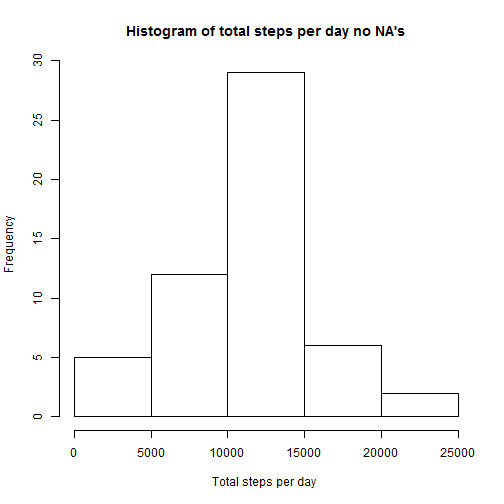

## Loading and preprocessing the data

```r
unzip("./activity.zip")
activityData<-read.csv("activity.csv")
```


## What is mean total number of steps taken per day?
1.

```r
totalStepsPerDay<-aggregate(steps ~ date, data = activityData,sum)
head(totalStepsPerDay)
```

```
##         date steps
## 1 2012-10-02   126
## 2 2012-10-03 11352
## 3 2012-10-04 12116
## 4 2012-10-05 13294
## 5 2012-10-06 15420
## 6 2012-10-07 11015
```

2.Now we can create the histogram of the total number of steps taken per day.

```r
hist(totalStepsPerDay$steps,xlab = "Total steps per day",main = "Histogram of total steps per day")
```

 

3.Below you will find the mean and median of the total number of steps taken per day:

```r
mean(totalStepsPerDay$steps)
```

```
## [1] 10766.19
```

```r
median(totalStepsPerDay$steps)
```

```
## [1] 10765
```

## What is the average daily activity pattern?
1.

```r
dailyactivity<-aggregate(steps ~ interval, data = activityData, mean)
with(dailyactivity,plot(interval~steps,type = "l"))
```

 

2.We can find the 5 minute interval(accross all days) that contains the maximum number of steps with the following code chunk:

```r
dailyactivity[which.max(dailyactivity$steps),]
```

```
##     interval    steps
## 104      835 206.1698
```

## Imputing missing values
1.The total number of missing values in dataset is:


```r
length(which(is.na(activityData)))
```

```
## [1] 2304
```

2.We will replace the NA values with the mean for that 5-min interval.

3.We produce the new dataset with the following code:
Firstly we find the rows tha have na in steps value.
Secondly we match the intervals' values for these rows in dailyactivity data set and we set the mean value of the steps to the original dataset.


```r
rowsWithNa<-is.na(activityData$steps)
activityData[rowsWithNa,1]<-dailyactivity[(activityData[rowsWithNa,3] %in% dailyactivity$interval),2]
head(activityData)
```

```
##       steps       date interval
## 1 1.7169811 2012-10-01        0
## 2 0.3396226 2012-10-01        5
## 3 0.1320755 2012-10-01       10
## 4 0.1509434 2012-10-01       15
## 5 0.0754717 2012-10-01       20
## 6 2.0943396 2012-10-01       25
```
4.
Recomputing the total steps per day with na's filled:


```r
totalStepsPerDayNoNa<-aggregate(steps ~ date, data = activityData,sum)
```

Remaking the histogram:


```r
hist(totalStepsPerDayNoNa$steps,xlab = "Total steps per day ",main = "Histogram of total steps per day no NA's")
```

 

Recomputing the mean and median total number of steps taken per day:


```r
mean(totalStepsPerDayNoNa$steps)
```

```
## [1] 10766.19
```

```r
median(totalStepsPerDayNoNa$steps)
```

```
## [1] 10765.59
```

Comparing the old results with the new ones we notice that filling the na's caused an increase in frequency range in our histogram (form 0-25 to 0-30). Also the mean and median values are now exactly the same (10766.19).

## Are there differences in activity patterns between weekdays and weekends?
1.We will use library dply so we load it and then we create the new column

```r
library(dplyr)
activityData<-mutate(activityData,kindOfDay=ifelse(as.POSIXlt(date)$wday %in% c(0,1),"weekend","weekday"))
activityData$kindOfDay<-as.factor(activityData$kindOfDay)
```

2.Creating the new dataset that contains the new column and the create our plot using lattice.


```r
library(lattice)
dailyactivityNew<-aggregate(steps ~ interval+kindOfDay, data = activityData, mean)
xyplot(steps ~ interval|kindOfDay,data=dailyactivityNew,type ="l",xlab ="Interval",ylab="Number of steps",layout=c(1,2))
```

 
